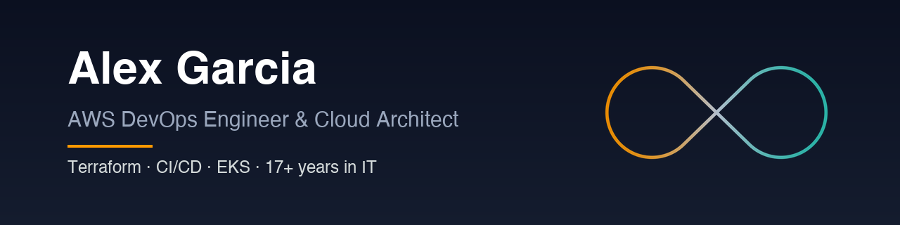

# Alex Garcia

AWS DevOps Engineer and Cloud Architect based in Mexico, working US Central hours.

I'm an AWS DevOps engineer with more than 17 years in IT. I build and repair AWS infrastructure and delivery
pipelines using Terraform, AWS CDK, CI/CD and containers. I document the plan before making any change, submit pull
requests for your team's review, and remove the access you gave me when I hand over the work.

## What I do

Each service links to a public repository with a sample deliverable or working code you can inspect.

- **Terraform on AWS audit and fix**: a ranked diagnosis of risky infrastructure code, fixes as pull requests and a
  state migration that destroys nothing. Evidence:
  [`terraform-aws-rescue-lab`](https://github.com/gamaware/terraform-aws-rescue-lab)
- **CI/CD pipeline to AWS**: keyless deploys through OIDC, with image scanning and automatic rollback. Evidence:
  [`github-actions-aws-oidc-lab`](https://github.com/gamaware/github-actions-aws-oidc-lab)
- **AWS security and IAM review**: findings ranked by risk, policy rewrites that narrow access, and a baseline set of
  guardrails. Evidence: [`aws-iam-security-review-sample`](https://github.com/gamaware/aws-iam-security-review-sample)
- **Kubernetes on Amazon EKS**: clusters built with Terraform and delivered through Helm and Argo CD. Evidence:
  [`terraform-aws-eks-gitops-lab`](https://github.com/gamaware/terraform-aws-eks-gitops-lab)
- **Containerize and deploy to ECS Fargate**: a repeatable, reversible path from one machine to AWS. Evidence:
  [`aws-ecs-fargate-deploy-lab`](https://github.com/gamaware/aws-ecs-fargate-deploy-lab)
- **AWS landing zone for a new project**: separate accounts, central sign-in, an audit trail and tested service
  control policies. Evidence:
  [`terraform-aws-landing-zone-lab`](https://github.com/gamaware/terraform-aws-landing-zone-lab)
- **DevOps and Well-Architected assessment**: a risk-rated backlog and a roadmap your team can execute. Evidence:
  [`aws-well-architected-assessment-sample`](https://github.com/gamaware/aws-well-architected-assessment-sample)
- **AWS cost optimization audit**: ranked savings with stated assumptions, plus tagging and ownership for the spend.
  Evidence: [`aws-cost-optimization-audit-sample`](https://github.com/gamaware/aws-cost-optimization-audit-sample)
- **Migration to AWS**: a wave plan and a cutover runbook with rollback triggers. Evidence:
  [`aws-migration-runbook-sample`](https://github.com/gamaware/aws-migration-runbook-sample)
- **AWS workshop and mentoring**: hands-on labs with starter code, solutions and tests. Evidence:
  [`aws-devops-workshop-labs`](https://github.com/gamaware/aws-devops-workshop-labs)

## Featured work

Every repository uses a fictional client and verifies its evidence offline, without an AWS account.

| Repository | Outcome |
| --- | --- |
| [`aws-devops-portfolio`](https://github.com/gamaware/aws-devops-portfolio) | Index of every service, with a check that keeps the whole collection consistent |
| [`terraform-aws-rescue-lab`](https://github.com/gamaware/terraform-aws-rescue-lab) | Untrusted Terraform turned into tested modules with remote state and a plan gate |
| [`github-actions-aws-oidc-lab`](https://github.com/gamaware/github-actions-aws-oidc-lab) | Long-lived CI keys replaced by OIDC, and deploys that fail when ECS rolls back |
| [`aws-iam-security-review-sample`](https://github.com/gamaware/aws-iam-security-review-sample) | Security review report with ranked findings and a control-to-evidence map for SOC 2 |
| [`terraform-aws-eks-gitops-lab`](https://github.com/gamaware/terraform-aws-eks-gitops-lab) | EKS through Terraform modules, a Helm chart and Argo CD folders per environment |
| [`aws-ecs-fargate-deploy-lab`](https://github.com/gamaware/aws-ecs-fargate-deploy-lab) | API containerized and deployed to Fargate with a circuit breaker and alarm-based rollback |
| [`terraform-aws-landing-zone-lab`](https://github.com/gamaware/terraform-aws-landing-zone-lab) | Multi-account foundation with AWS Organizations and guardrails tested against real requests |
| [`aws-well-architected-assessment-sample`](https://github.com/gamaware/aws-well-architected-assessment-sample) | Assessment across the pillars and the DevOps lens, with a ranked backlog and roadmap |
| [`aws-cost-optimization-audit-sample`](https://github.com/gamaware/aws-cost-optimization-audit-sample) | Savings split into quick wins and planned work, each recalculated from billing data |
| [`aws-migration-runbook-sample`](https://github.com/gamaware/aws-migration-runbook-sample) | Wave plan, AWS DMS tasks and a timed cutover runbook with a way back |
| [`aws-devops-workshop-labs`](https://github.com/gamaware/aws-devops-workshop-labs) | Numbered labs on AWS, Terraform, CDK and CI/CD, each tested against its solution |
| [`cdk-python-nag-pipeline-lab`](https://github.com/gamaware/cdk-python-nag-pipeline-lab) | CDK Pipelines app in Python that stops on any unacknowledged cdk-nag finding |

## Tech stack

AWS, Terraform, AWS CDK, CloudFormation, Amazon EKS, Amazon ECS, Helm, Argo CD, GitHub Actions, GitLab CI,
AWS CodePipeline, Docker, Python, Bash, Checkov, Trivy.

## Certifications

- AWS Certified SysOps Administrator – Associate
- AWS Certified Developer – Associate
- AWS Certified Cloud Practitioner
- AWS Certified AI Practitioner
- AWS Academy Certified Educator

## Teaching

Adjunct professor of Cloud Architecture and Scalable Systems Design at a university in Guadalajara.

## Contact

I work in English and Spanish, and I reply within a business day on weekdays.

